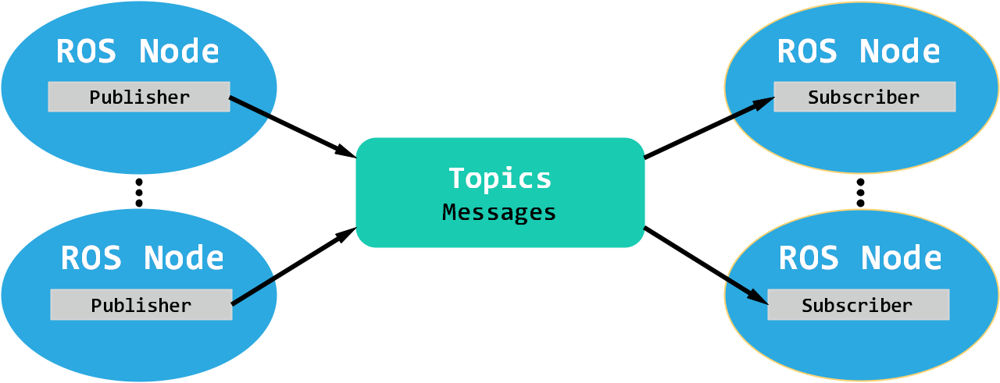

# ROS 基础概念
---
## ROS是什么  
>ROS-机器人操作系统（Robot Operating System） 他并不是一个真正的操作系统，而是一个分布式通信框架 + 开发工具集。  

ROS最直接的作用是作用：让摄像头、激光雷达、底盘、云台这些模块能够方便地互相通信，不用大家自己写Socket/串口协议。

### ROS的哲学：
  **解耦合** ： 使用ROS，就是与一系列的节点打交道。每个节点的功能尽可能单一明确；节点间通过事先预定好的方式进行通信。  
  **分散式** ： 节点可在多台电脑上运行，并通过网络进行通讯。  
  **开源分享**： ROS功能包的特性使得部署使用其他人的代码非常方便，ROS本身也是一个不断壮大的开源项目。
## ROS的核心概念  
### 节点  
节点是 ROS 中的最小执行单元（常常对应一个可执行程序或进程），负责完成一项具体任务（例如：相机驱动、目标识别、底盘控制、串口读写）。
暂且可以认为一个节点负责完成一项任务。例如“相机驱动节点”、“串口通信节点”、“导航节点”。  
**节点由包（package）里的可执行文件启动。**  

查看所有的ROS2节点：  
`ros2 node list `

### 节点间通讯
节点间通讯包含几种模式：实时广播式（Topic/Message）、请求—应答（Service）、长时任务带反馈（Action）、与参数服务器（Parameter）。  

**1. ROS2的跨进程通讯方式**  
ROS2 基于 DDS（Data Distribution Service）实现底层传输，支持进程内、进程间、主机间通信以及 QoS 配置（可靠/不可靠、历史缓存等）。  
暂时不用了解DDS相关的更多知识（在实际使用中很少会直接与其打交道），但需要知道，不同 QoS 或网络设置会导致“看不到话题/收不到消息”，需要理解并排查。

**2. Topic/Messgage**
Topic 是一种“发布/订阅”机制，适合连续流数据（传感器数据、位姿、速度命令等）。Message 是 topic 上传输的数据结构（类似 C/C++ 结构体）。一个ROS节点可以发布/订阅多个topic，一个topic也可以有多个发布/订阅者。
使用Topic方式进行通讯时有几个要素，分别是：  
>Publisher（发布者）：数据的发布者  
Subscriber（订阅者）： 数据的接收者 
Topic（话题名称）： Publisher/Subscriber通过指定的话题名称进行通讯
Message（消息类型）： 数据首发需要先约定好一种消息类型。
Qos(服务质量)： 不同的Qos可以适应不同的可靠性/实时性要求。publisher和subscriber的Qos必须设置相同，否则无法正常传递数据。

  

**3. Service**
服务适用于一次性请求—应答的交互（短、小、必须立刻得到返回的请求）,例如请求一次性数据，置位/读取状态。  
服务不是流式传输而是请求-响应式的，所以并不适合用于高频数据。

**4. Action**  
Action类型适合需要较长时间执行、并且需要中间反馈与取消功能的任务（例如导航、运动规划）。与Service类型类似，使用action需要先发起一个请求，随后action服务器会不断反馈一些数据，直到达到目标。
因此，一个完整的action类型需要3个通道（Goal/Feedback/Result），还要设计好取消逻辑与边界条件。  

**5. Parameter**
Parameter(参数)是ROS节点的可配置项，在ROS节点启动或运行时可以进行读写。Parameter适合用来存放需要调整但运行时不会再变动的数据。  
典型的参数运用有导航的各项参数，节点运行时的topic发布频率等。   

总之，**对于传感器/流式数据，选择Topic；对于一次性请求，选择Service；长时需反馈选择 Action；对于可调配置 ，选择Parameter**  


### 包（Package）、工作区（Workspace）与构建工具（colcon）  
Workspace（工作空间）通俗来讲就是存放所有代码的大文件夹。Package（包）是把程序和其元信息打包成一个可被其它人引用的“单元”，colcon 是负责把 workspace 里所有 package 统筹编译并安装到可运行位置的“构建工具”。
回顾之前了解过的cmakelist，对于每一个package，都会有一个Cmakelists文件告诉电脑如何编译这个 package（要哪些头文件、生成哪些可执行文件、如何安装）。
一个常见的ROS工作空间通常如下：
```
ros2_ws/
  └─ src/
      └─ my_cpp_pkg/
          ├─ package.xml
          ├─ CMakeLists.txt
          └─ src/
              └─ talker.cpp
```
**为什么要有这三者？**  
1. 可复用： 把功能拆成 package，别人可以直接下载package并快速部署使用。
2. 可并行开发：多人分别在不同 package 上开发，互不干扰。  
3. 构建一致性：colcon + ament 保证不同 package 在不同机器上能被一致构建并安装成可完成相同任务的ROS2节点。  

#### **Package**  
Package类似小盒子（一个功能单元）：里边有源代码、依赖声明（package.xml）、构建脚本（CMakeLists 或 setup.py）、配置与资源。
而Workspace类似车间 + 仓库，把很多小盒子放一起，进行统一构建与安装。  
对于一个package，最明显的特征是其内部含有的package.xml文件。  
一个package.xml的例子如下：
```
<package format="3">
  <name>my_cpp_pkg</name>                
  <version>0.0.0</version>
  <description>示例包</description>
  <maintainer email="you@ex.com">you</maintainer>
  <license>Apache-2.0</license>

  <buildtool_depend>ament_cmake</buildtool_depend>  <!-- 使用 ament_cmake 构建 -->
  <depend>rclcpp</depend>                            <!-- 运行时/编译时依赖 -->
  <depend>std_msgs</depend>
</package>
```  
package.xml 声明依赖（让 rosdep 能安装系统依赖），并告知构建工具这个包使用哪个 build system（ament_cmake 或 ament_python）。

**rosdep 的角色**
当你在另外机器上只拷贝工作空间中/src目录下的功能包时，系统可能缺少库。利用 rosdep 可以实现自动安装：
```
rosdep update
rosdep install --from-paths src --ignore-src -r -y
```  
以上这条命令会读取 package.xml 中列出的依赖并调用安装所需系统包。  

#### **构建工具**
在前面的培训中我们已经大致学习和了解了`g++->make->cmake`这一条构建链条。而colcon工具则是一个高于 gcc/make/cmake 的“多包构建调度器”。  简单来说，colcon扫描 workspace 内的多个 package、解析依赖关系，然后按顺序调用每个 package 对应的底层构建系统（如 ament_cmake/CMake、ament_python 等）来统一构建、安装与测试。  
具体来讲，colcon 读取每个 package 的 package.xml，构建一个有向依赖图，然后进行拓扑排序，形成一个合理的编译顺序。colcon 默认并行，但倘若 A 依赖 B，colcon 会确保先构建 B 再构建 A。  

**当然，在实际使用中，我们基本不会和colcon工具本身打过多的交道**。其实，你只需要会敲这一行就可以了(
```
colcon build
```
随后，colcon工具会自动执行，完成编译。
附加选项如`--packages-select`、`--symlink-install`有时也会用到，大家可以自行查阅，此处不再赘述。  
colcon build结束后，程序还不能马上运行。需要`source install/setup.bash`让 shell 知道刚构建产物的位置与环境变量。  

## 其他
作者并非计科专业学生，对ROS的了解也并非很深入。写这个教程的目的在于让此前没有接触过相关方面的新同学尽快了解和上手ROS2。若有错误和疏漏，还请指出。

最后附上一些参考资料：  
[赵虚左老师的视频教程](https://www.bilibili.com/video/BV1VB4y137ys/)  
[深北莫 陈佬的导航与仿真开源](https://github.com/SMBU-PolarBear-Robotics-Team/pb2025_sentry_nav)  
[ROS2 Official Documentation](https://docs.ros.org/en/humble/)  
[Nav2 Official Documentation](https://docs.nav2.org/)
[伟大的GPT老师](https://chatgpt.com/)  
[伟大的开源库与教程Python Robotics](https://github.com/AtsushiSakai/PythonRobotics)  

