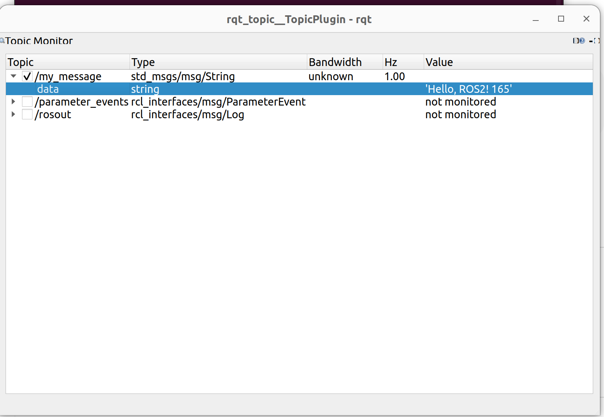

# 节点与节点编写
---
在前面的介绍中我们已经大致了解了工作空间、包和节点的概念。如你所见，整个教程都处在一个叫做“tutorial_ws”的工作空间之下。   
**现在，让我们尝试创建一个自己的ROS功能包，并编写自己的第一个节点**  

## 创建功能包  
在02node文件夹下打开终端，输入
```
cd ./src
ros2 pkg create my_first_package --build-type ament_cmake --dependencies rclcpp
```
`--build-type ament_cmake` 表示使用 CMake 构建
`--dependencies rclcpp` 表示依赖 ROS2 的 C++ 客户端库
运行后，系统会生成一个标准的包结构:
```
02node
└── my_first_package
    ├── CMakeLists.txt
    ├── include
    │   └── my_first_package
    ├── package.xml
    └── src

```
## 查看依赖
在 package.xml 里，可以看到 ROS2 自动帮我们写入了依赖：
```
<depend>rclcpp</depend>
```
如果未来要用到其他库，比如 std_msgs（标准消息类型），也需要在这里添加：  
```
<depend>std_msgs</depend>
```
现在，请你手动加入std_msgs作为依赖项。

## 编写源文件
进入my_first_package/src文件夹，创建一个名为`helloworld.cpp`的文件，随后写入
```
// 包含必要的ROS2头文件
#include "rclcpp/rclcpp.hpp"              // ROS2客户端库的核心功能
#include "std_msgs/msg/string.hpp"        // 标准字符串消息类型

// 定义自定义的发布者节点类，继承自rclcpp::Node
class MyPublisher: public rclcpp::Node
{
public:
    // 构造函数：初始化节点和成员变量
    MyPublisher(): Node("my_publisher"),  // 调用基类构造函数，设置节点名为"my_publisher"
                   count_(0)              // 初始化计数器为0
    {
        // 创建发布者（Publisher）
        // 参数说明：
        // - "my_message": 话题名称
        // - 10: 队列大小（缓存的消息数量）
        publisher_ = this->create_publisher<std_msgs::msg::String>("my_message", 10);
        
        // 创建定时器（Timer），每秒触发一次
        // 参数说明：
        // - std::chrono::seconds(1): 定时器周期为1秒
        // - std::bind(...): 绑定回调函数，当定时器触发时调用timer_callback方法
        timer_ = this->create_wall_timer(
            std::chrono::seconds(1),
            std::bind(&MyPublisher::timer_callback, this)
        );
    }

private:
    // 定时器回调函数 - 当定时器触发时自动调用
    void timer_callback()
    {
        // 创建一个字符串消息对象
        auto message = std_msgs::msg::String();
        
        // 设置消息内容：包含问候语和计数器值
        message.data = "Hello, ROS2! " + std::to_string(count_++);
        
        // 在终端输出日志信息（INFO级别）
        // RCLCPP_INFO是ROS2的日志宏，类似于printf但功能更强大
        RCLCPP_INFO(this->get_logger(), "Publishing: '%s'", message.data.c_str());
        
        // 发布消息到话题
        publisher_->publish(message);
    }

    // 成员变量声明
    rclcpp::Publisher<std_msgs::msg::String>::SharedPtr publisher_;  // 发布者指针
    rclcpp::TimerBase::SharedPtr timer_;                             // 定时器指针
    size_t count_;                                                   // 消息计数器
};

// 主函数 - 程序的入口点
int main(int argc, char * argv[])
{
    // 初始化ROS2客户端库
    // 必须在使用任何ROS2功能之前调用
    rclcpp::init(argc, argv);
    
    // 创建节点对象
    // std::make_shared是智能指针，用于自动管理内存
    auto node = std::make_shared<MyPublisher>();
    
    // 进入事件循环，保持节点运行
    // spin()会阻塞当前线程，等待和处理事件（如定时器、订阅消息等）
    rclcpp::spin(node);
    
    // 关闭ROS2客户端库，清理资源
    rclcpp::shutdown();
    
    return 0;
}
```
以上代码会定时1s发布一次话题，并在终端中打印一句话。
需要注意的是，ROS2节点采用了OOP思想，并且常常使用c++11、14的一些新特性（但不多），如果发现有哪一行看不懂，需要自己再去了解一下。

## 修改CMakelists
打开 CMakeLists.txt，添加以下内容  
```
find_package(rclcpp REQUIRED)
# 新增下面部分
#需要 std_msgs包
find_package(std_msgs REQUIRED)  

#指定编译 src/helloworld.cpp 生成可执行文件
add_executable(helloworld src/helloworld.cpp)  

#把依赖库的头文件、库文件、编译选项一次性加到目标可执行文件里
ament_target_dependencies(helloworld rclcpp std_msgs)

#安装到 ROS2 的默认路径，方便 ros2 run 调用
install(TARGETS
  helloworld
  DESTINATION lib/${PROJECT_NAME})
```
就像我们在写 CMakeLists 时会写 target_link_libraries 来链接依赖库，ROS 里我们用 ament_target_dependencies 一次性引入 ROS2 的依赖。

## 编译和安装
回到工作空间根目录，编译功能包：
```
cd ~/tutorial_ws
colcon build --packages-select my_first_package
```

编译完成后，执行：
```
source install/setup.bash
```
这样系统就能找到我们编译好的新节点。
## 尝试运行

运行刚才编译好的节点：
```
ros2 run my_first_package helloworld
```

终端应该输出类似如下的内容：
```
[INFO] [1759326268.267211126] [my_publisher]: Publishing: 'Hello, ROS2! 0'
[INFO] [1759326269.267227238] [my_publisher]: Publishing: 'Hello, ROS2! 1'
[INFO] [1759326270.267342887] [my_publisher]: Publishing: 'Hello, ROS2! 2'
```

此时我们另外打开一个终端，输入：
```
ros2 topic echo /my_message
```

应该可以看到类似以下内容：
```
data: Hello, ROS2! 0
---
data: Hello, ROS2! 1
---
data: Hello, ROS2! 2
```

**恭喜 🎉 你已经完成了第一个 ROS2 节点！**  

## rqt工具 
### 为什么使用rqt？
在使用ROS的过程中，有不少小工具可以帮助我们检查编写的节点。虽然ros2 topic echo可以打印出具体的消息，但是并不直观。所以我们需要一种图形化的方法来看到节点和话题的状态，这就是rqt这个工具的意义。
### rqt是什么？
rqt 是 ROS 自带的 图形化工具框架，它就像一个“工具箱”。它的每个功能是一个“小插件”，你可以按需加载。常用的插件有：  

>rqt_graph：查看节点之间的连接关系
rqt_topic：查看话题的实时数据
rqt_plot：把数值型数据画成曲线图

### rqt的使用
运行之前编写的发送节点，另外开启一个终端，输入：
```
ros2 run rqt_topic rqt_topic
```
可以看到之前发布的`/my_message`话题，在话题前的方框打勾，便可以看到`/my_message`具体内容和频率。  
如果是自定义消息类型，在使用rqt查看之前，需要先source你的工作空间。




## 自定义消息类型
ROS中的topic非常强大，不仅可以传输各种基本数据类型如int、float、string（利用std_msgs库），也可以传输复杂的自定义类型，（如以后会用到的imu数据类型、pointcloud数据类型）。接下来，我们将教会大家如何创建自己的消息类型。  

### 创建功能包
习惯上，我们会单独为消息创建一个独立的包（消息包和功能逻辑分开）
```
ros2 pkg create my_msgs --build-type ament_cmake --dependencies std_msgs
```

随后在my_msgs目录下创建msg文件夹，目录结构如下：
```
my_msgs/
├── CMakeLists.txt
├── package.xml
└── msg/
```

### 定义消息
在/msg文件夹下创建一个新的.msg文件，例如Sentry.msg，写入
```
uint8 id
int32 hp
float32 x
float32 y
```
这就定义了一种新的消息类型my_msgs/msg/Sentry，它包含了四种字段
**注意：.msg 文件必须放在 msg/ 文件夹下，否则编译不会识别。**
### 修改package.xml
在 package.xml 里添加对消息生成工具的依赖：
```
<buildtool_depend>ament_cmake</buildtool_depend>

<!-- 这里声明自己是接口包 -->
<member_of_group>rosidl_interface_packages</member_of_group>

<!-- 消息生成需要 -->
<build_depend>rosidl_default_generators</build_depend>
<exec_depend>rosidl_default_runtime</exec_depend>
```

### 修改 CMakeLists.txt
找到 CMakeLists.txt，添加以下内容：
```
find_package(rosidl_default_generators REQUIRED)

rosidl_generate_interfaces(${PROJECT_NAME}
  "msg/Sentry.msg"
  DEPENDENCIES std_msgs
)

ament_export_dependencies(rosidl_default_runtime)
```
这样就告诉 CMake：编译时需要生成消息接口。

### 编译消息包
回到工作空间并编译：
```
colcon build --packages-select my_msgs
```

编译成功并source后，可以检查新消息是否生成：
```
ros2 interface show my_msgs/msg/Sentry
```

可以看到返回：
```
~/tutorial_ws$ ros2 interface show my_msgs/msg/Sentry
uint8 id
int32 hp
float32 x
float32 y
```

## 优化
为了告诉电脑编译完成后安装的文件在哪里，每次打开一个新的终端后，我们都要执行以下操作：
```
source {你的工作空间}/install/setup.bash
```
显然这是一个非常麻烦的事，所以我们可以执行以下操作：
```
echo "source {你的工作空间路径}/install/setup.bash" >> ~/.bashrc
```
比如说
```
echo "source /home/lehan/tutorial_ws/install/setup.bash" >> ~/.bashrc
```
以后再启动终端时，就不用再手动刷新环境变量了。


## 作业

1. 你已经掌握了最简单的topic发布者写法，接下来，请你修改之前编写的helloworld节点，使其发送我们刚才新定义的Sentry类型消息，并在命令行中查看。
2. 查阅rclcpp::Subscription的使用方法，尝试在my_first_package包下再编写一个节点，用于接收刚才发送的自定义消息，并打印到屏幕上。
3. 运行发布者节点和接收者节点，随后在命令行中输入`ros2 run rqt_graph rqt_graph`，理解节点和话题的连接关系。
4. 查询资料或询问LLM，了解并尝试编写一对使用service和action的节点。