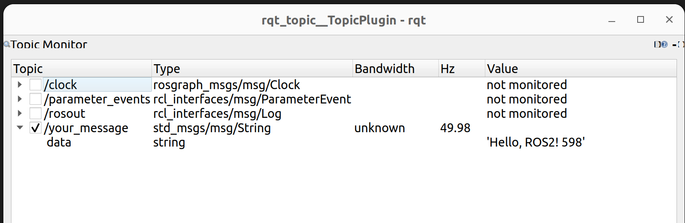

# ROS2 节点进阶
在上一课中，我们已经学习了如何编写基本的发布/订阅节点，并且使用了自定义消息类型完成通信。但在实际项目中，单个节点往往不足以支撑整个系统。我们需要一种方法来统一启动、配置和管理多个节点。

## Launch文件
### 为什么我们需要Launch文件？
当我们有多个节点时，如果每次都要开一堆终端运行`ros2 run`，会非常麻烦。而Launch 文件允许我们用一个`.launch.py` 文件来统一启动所有节点，并且可以实现“**启动、传参、重映射、命名空间、环境变量、延时、包含其它 launch**”等功能。它的语法基于 Python，灵活可扩展。  
我不会再详细介绍launch相关的python语法与接口，在绝大部分实际使用中，询问LLM即可。

### launch文件的使用  
在之前编写的my_first_package中创建一个新的文件夹`launch`，在`launch`文件夹下创建`launch_nodes.launch.py`。  
一个最小的launch文件通常如下：
```
from launch import LaunchDescription
from launch_ros.actions import Node

def generate_launch_description():
    ld = LaunchDescription()
    node = Node(
        package='my_first_package',
        executable='helloworld',   # CMakeLists 中 add_executable 的 target 名
        name='my_publisher',
        output='screen',
        emulate_tty=True
    )
    ld.add_action(node)
    return ld
```

对于`Node`,常用的配置参数有以下这些，现阶段了解即可：
```
Node(
    package='my_pkg',                # package 名
    executable='my_node',            # 可执行名 (C++ 对应 target 名)
    name='node_name',                # 覆盖节点名（可选）
    namespace='robot1',              # 命名空间（可选）
    output='screen',                 # 'screen' 或 'log'
    emulate_tty=True,                # 终端仿真（保留彩色日志，建议 screen 时加）
    parameters=[                     # 参数支持 yaml 路径或 dict
        'config/params.yaml',
        {'rate': 10}
    ],
    remappings=[('/old','/new')],    # 话题重映射列表
    arguments=['--ros-args','--log-level','info'], # 传给节点的命令行 args
    respawn=False,                   # 节点挂掉后是否重启
)
```
这些参数多数情况用不到，最常用的就是 **package / executable / name / parameters / remappings**

仅仅编写新的launch文件还不够，我们还要对应修改CMakelists，让功能包在编译时正确处理这个launch文件。  
在CMakelist中加入以下内容：
```
install(
  DIRECTORY launch
  DESTINATION share/${PROJECT_NAME}
)
```
install(DIRECTORY ...) 会把 launch/ 和 config/ 下的文件复制到 `install/share/{pkg}/`，ros2 launch 根据 package 的 share 路径查找 launch 文件。

修改完之后，编译你的代码，source后尝试运行：
```
ros2 launch my_first_package launch_nodes.launch.py
```

若一切顺利，可以看到控制台的输出类似：
```
[INFO] [launch]: All log files can be found below /home/lehan/.ros/log/2025-10-02-14-36-50-272975-lehan-57384
[INFO] [launch]: Default logging verbosity is set to INFO
[INFO] [helloworld-1]: process started with pid [57385]
[helloworld-1] [INFO] [1759387011.321331345] [my_publisher]: Publishing: 'Hello, ROS2! 0'
[helloworld-1] [INFO] [1759387012.321335475] [my_publisher]: Publishing: 'Hello, ROS2! 1'
[helloworld-1] [INFO] [1759387013.321241405] [my_publisher]: Publishing: 'Hello, ROS2! 2'
```

## yaml参数设置
在前面我们写节点时，参数大多是写死在代码里的，比如
```

publisher_ = this->create_publisher<std_msgs::msg::String>("my_message", 10);

......

timer_ = this->create_wall_timer(
    std::chrono::seconds(1),
    std::bind(&MyPublisher::timer_callback, this)
);
```
此处的话题名称和发布频率是定死的。
问题是：
改参数要重新编译，麻烦。    
一个节点可能有几十个参数，写死在代码里不便于管理。  
把参数写在一个独立的配置文件（通常是 YAML 文件）里，运行节点时再加载进去，这样就能做到灵活调参、一份参数多次复用。  

### ROS2的参数YAML文件结构
在 ROS2 中，参数 YAML 文件必须遵循一定格式：
```
my_node_name:               # 节点的名字（必须匹配）
  ros__parameters:          # 固定写法，表示参数列表
    publish_rate: 10
    use_sim_time: true
    robot_radius: 0.25
```
参数的类型可以是整数、浮点、布尔、字符串、列表。

### 在launch文件中加载YAML
假设我们现在在功能包的`/config`文件夹下有一个params.yaml：
```
my_publisher:               
  ros__parameters:    
    publish_rate: 10
    use_sim_time: true
    robot_radius: 0.25
    topic_name: "your_message"
```
>**注意，有时我们会看到话题名称前带"/"，有时则不带。带 / 的话题名称是全局绝对路径，在整个ROS系统中唯一；而不带 / 的是相对路径，会基于节点所在的命名空间自动扩展成完整路径。**

并配置好CMakelists：
```
install(
  DIRECTORY config
  DESTINATION share/${PROJECT_NAME}
)
```
>这表示把功能包目录下的`config`文件夹安装到share/{包名}目录下。  

之后，修改之前的launch文件。首先import需要用到的模块
```
from launch.substitutions import PathJoinSubstitution
from launch_ros.substitutions import FindPackageShare
```
然后在generate_launch_description函数中增加：
```
    # 拼接 config 文件路径
    config = PathJoinSubstitution([
        FindPackageShare('my_first_package'),
        'config',
        'params.yaml'
    ])
```
`FindPackageShare`函数返回my_first_package的真实路径，这样拼接可以避免功能包移动后因找不到路径而无法正常工作。  

并且将node更改为以下形式：
```
node = Node(
    package='my_first_package',
    executable='helloworld',
    name='my_publisher',
    parameters=[config],   # 注意这里传的是一个列表
    output='screen'
)
```
此时，yaml文件就已被正常加载了。

### 在代码中读取参数
在节点的构造函数中新增以下代码:  
```
#如果不 declare_parameter，launch 传进来的参数也会报错找不到；declare_parameter 是告诉 ROS2 “我的节点需要这个参数”。
this->declare_parameter<int>("publish_rate", 10);
int rate = this->get_parameter("publish_rate").as_int();

this->declare_parameter<std::string>("topic_name", "/default_topic");
std::string topic = this->get_parameter("topic_name").as_string();
```

**并同步更改发布者的话题名和timer的周期为对应变量**。若设置正确，就可以看到现在发布的话题是这样的：



## 作业
1. 尝试自己编写功能更多的launch文件，例如使用一个launch文件一并启动前面撰写的消息收发节点，并且让接收节点先启动，发送节点延迟5s启动。