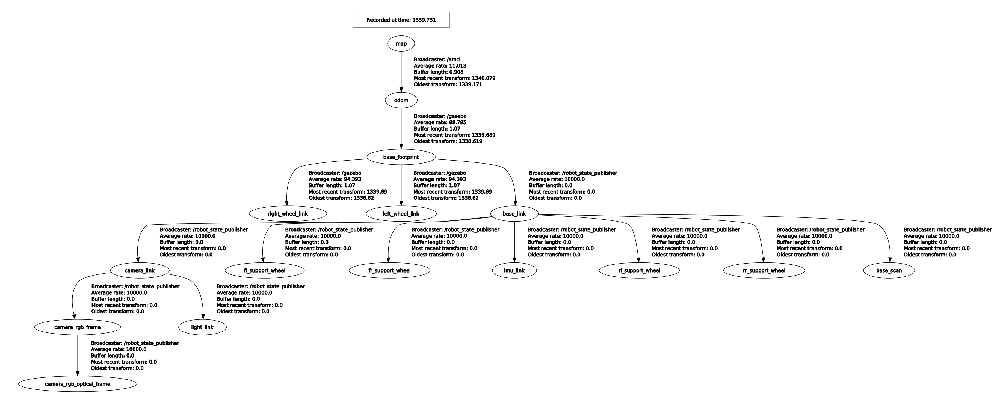
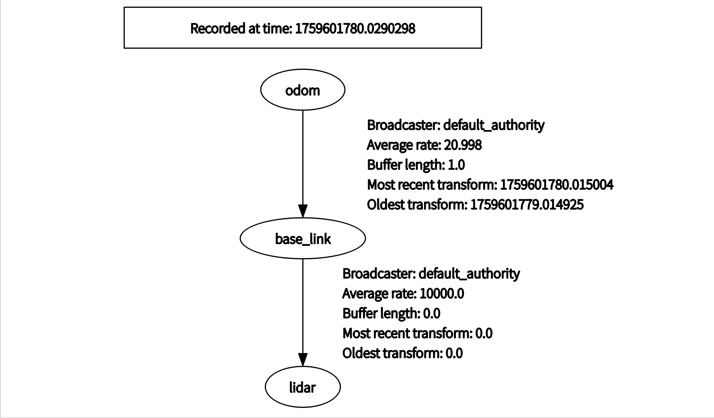

# 传感器与可视化
## 常用传感器与对应msg类型
下面列出比赛与机器人开发中常用的传感器类型与对应的 ROS2 message 类型。
**3D 点云：sensor_msgs/msg/PointCloud2**
用途：三维环境感知、障碍物检测、建图、目标分割。  

可以通过运行以下命令查看其定义：
```
ros2 interface show sensor_msgs/msg/PointCloud2
```

**IMU：sensor_msgs/msg/Imu**
用途：角速度（gyroscope）、线加速度（accelerometer）、姿态四元数（orientation），常用于姿态估计/滤波器。  

**里程计 / Odometry：nav_msgs/msg/Odometry**  
机器人局部位姿（pose）与速度（twist），用于定位与融合（如与 AMCL/SLAM 对接）。  

## 数据流中的关键要素
### Frame
frame(或frame_id / 坐标系)，是指每条消息的 `header.frame_id`。他描述的是传感器消息的来源（坐标系）。例如，imu数据的坐标原点通常是imu模块，3D点云数据的坐标原点通常是激光雷达本体。不同的传感器安装位置不同，自然要标明数据的坐标系。  
在ROS中，所有frame(坐标系)之间的关系通过TF维护，我们在接下来会详细介绍。
### 时间戳
时间戳是指每条传感器消息头部的`header.stamp`，它标记了这条数据的产生时间，可以用于不同传感器之间的数据对齐。
>**注意**，若使用仿真或播放 bag，必须启用 use_sim_time。此时时间戳的时间来自发布的/clock话题，否则来自系统时间。
### QoS
ROS2 基于 DDS，消息传输由 QoS 策略控制（可靠性、历史、深度等），发布者和订阅者的 QoS 若不匹配，**会导致无法正常接收到消息**。  

常见的 QoS 策略：
**reliability**: RELIABLE 或 BEST_EFFORT。控制命令多用 RELIABLE，高频图像/点云可用 BEST_EFFORT。

**history**: KEEP_LAST（depth）或 KEEP_ALL（全部）。

**durability**: VOLATILE 或 TRANSIENT_LOCAL（是否让后加入的订阅者收到历史数据）。  
**建议**：对“高带宽但可丢帧”的传感器可使用 BEST_EFFORT；对“关键控制”使用 RELIABLE。

### TF
TF是transformations Frames的缩写。在ROS中，是一个工具包，提供了坐标转换的功能。
#### 1. 齐次变换矩阵
为了介绍TF，首先我们需要一点点（真的只有一点点）机器人学基础。  
在机器人系统中，我们常常需要处理不同坐标系之间的转换。
例如：相机坐标系下的一个点，如何表示到机器人底盘坐标系？这就需要齐次变换矩阵。  
$$
T =
\begin{bmatrix}
R & t \\
0 & 1
\end{bmatrix}
$$
齐次变换矩阵是一个**4x4的矩阵**，由两个部分组成，我们可以将其看作一个2*2的分块矩阵。
其中：  
左上角的$R$是$3 \times 3$的旋转矩阵
右上角的$t$ 是$3 \times 1$的平移向量
最后一行 $[0,0,0,1]$ 是“占位符”，保证矩阵可以做乘法  
>**在本套教程中  我们约定 $T_A^B$ 把点从 B 系 变换到 A 系**，也就是说：  
$T_A^B$ 是 B 相对于 A 的位姿
$T_A^B$可以把 “在 B 系表示的点” 变到 “A 系下的表示”
A 是目标/参考系（target/reference）,B 是源/原始系（source）
**在不同的场合，符号约定有可能不同，需要大家注意。**


现在，我们假设有一个测量点$^{lidar}\mathbf{P}_{l}$位于激光雷达本体为原点的坐标系下，它的齐次坐标是：  
$$
^{lidar}\mathbf{P}_{l} = 
\begin{bmatrix}
x_l \\
y_l \\
z_l \\
1 \\
\end{bmatrix}$$  
如果我们还知道**激光雷达坐标系到底盘中心坐标系的变换矩阵$T_{base}^{lidar}$**,就可以轻松计算出点$P_l$在底盘系下的坐标：
$$
^{base}\mathbf{P}_{l} = T_{base}^{lidar} ⋅ ^{lidar}\mathbf{P}_{l}
$$  

**链式变换**：
齐次矩阵的另一个强大之处是：**可以连续相乘**。
比如：  已知从 odom 到 map 的变换矩阵 $T_{map}^{odom}$  ,从 base 到 odom 的变换矩阵 $T_{odom}^{base}$。
那么机器人在 map 系下的位姿就是
$$
 T_{map}^{base} = T_{map}^{odom}  · T_{odom}^{base} 
$$
>**乘法顺序很重要：靠近被变换点的变换矩阵放在右边。**   

类似的，我们可以求出激光雷达点在map坐标系下的坐标：
$$
^{map}\mathbf{P}_{l} = T_{map}^{odom}  · T_{odom}^{base} · T_{base}^{lidar} ⋅ ^{lidar}\mathbf{P}_{l}
$$  

**逆变换**：  
若 $\mathbf{T}_{A}^{B}=\begin{bmatrix}R & t\\0&1\end{bmatrix}$，其逆为  
$$
(\mathbf{T}_{A}^{B})^{-1} \;=\; \mathbf{T}_{B}^{A} = 
\begin{bmatrix}
R^\top & -R^\top t \\
0^\top & 1
\end{bmatrix} =
\begin{bmatrix}
R^\top & -R^\top t \\
0 & 1
\end{bmatrix}
$$  
即，已知A->B的变换，要求B->A的变换，只需要对变换矩阵做简单的分块运算。而R(旋转矩阵)又是正交的，求逆只需取转置，非常方便。


#### 2. TF包简介与其性质  
让机器人按预期运动，其实就是要管理好系统中各个坐标系（frame）之间的变换关系。TF（tf2）包就是 ROS 中负责这件事的工具集：它提供一个时序化的变换缓存（transform buffer），并提供发布（broadcaster）与订阅/查询（listener/buffer）接口，方便不同节点用高度一致的方式表达和使用坐标系关系。
##### 2.1 TF 的基本性质
**TF树**
不论如何，TF 以“树”来组织坐标系（严格来说不应有环）。如下图所示的TF树：

带环的TF结构或来自不同节点发布的同一组TF关系通常会导致混乱。  
**自带时间戳**  
每个变换都有时间戳（header.stamp），TF 可以在时间轴上插值，从而把任意时刻的坐标变换出来。  
**静态与动态变换**
静态变换：两个坐标系之间恒定（例如传感器刚性安装在底盘上），用 static_transform_publisher发布一次即可。  
动态变换：随时间变化（例如 odom -> base_link 随机器人移动），需周期性发布。  
**坐标变换的方向与约定**  
在本教程中我们约定 $T_A^B$ 表示把在 B 系表示的点变换到 A 系（即 target=A，source=B）。在调用 API 时，明确 target_frame 与 source_frame 的顺序非常重要。

##### 2.2 尝试使用TF
新创建一个C++功能包，在package.xml增加以下depend:  

```
<depend>tf2_ros</depend>
<depend>geometry_msgs</depend>
<depend>tf2_geometry_msgs</depend>
```

在CMakelists中寻找这些包：  
```
find_package(tf2_ros REQUIRED)
find_package(geometry_msgs REQUIRED)
find_package(tf2_geometry_msgs REQUIRED)
```

随后新建一个cpp文件，比如叫'my_tf2_broadcaster.cpp'，随后修改Cmakelists，指定可执行文件、引入依赖并声明安装。  
在cpp文件中加入一下内容：
```
#include <rclcpp/rclcpp.hpp>
#include <tf2_ros/transform_broadcaster.h>
#include <tf2_ros/static_transform_broadcaster.h>
#include <geometry_msgs/msg/transform_stamped.hpp>


class MyPublisher : public rclcpp::Node {
public:
    MyPublisher()
    : Node("my_broadcaster")
    {
        static_broadcaster_ = std::make_unique<tf2_ros::StaticTransformBroadcaster>(this);
        geometry_msgs::msg::TransformStamped t;
        t.header.stamp = this->now();
        t.header.frame_id = "base_link";
        t.child_frame_id = "lidar";
        t.transform.translation.x = 0.15;
        t.transform.translation.y = 0.0;
        t.transform.translation.z = 0.2;
        t.transform.rotation.x = 0.0;
        t.transform.rotation.y = 0.0;
        t.transform.rotation.z = 0.0;
        t.transform.rotation.w = 1.0;
        static_broadcaster_->sendTransform(t);

        tf_broadcaster_ = std::make_unique<tf2_ros::TransformBroadcaster>(this);
        timer_ = create_wall_timer(
        std::chrono::milliseconds(50),
        std::bind(&MyPublisher::on_timer, this));
        RCLCPP_INFO(this->get_logger(), "My tf2 broadcaster is running!");
    }


private:
    void on_timer() {
    geometry_msgs::msg::TransformStamped t;
        t.header.stamp = now();
        t.header.frame_id = "odom";
        t.child_frame_id = "base_link";

        t.transform.translation.x = 1.0;
        t.transform.translation.y = 0.0;
        t.transform.translation.z = 0.0;
        t.transform.rotation.x = 0.0;
        t.transform.rotation.y = 0.0;
        t.transform.rotation.z = 0.0;
        t.transform.rotation.w = 1.0;
        tf_broadcaster_->sendTransform(t);
    }


    rclcpp::TimerBase::SharedPtr timer_;
    std::unique_ptr<tf2_ros::TransformBroadcaster> tf_broadcaster_;
    std::unique_ptr<tf2_ros::StaticTransformBroadcaster> static_broadcaster_;
};

int main(int argc, char ** argv)
{
    rclcpp::init(argc, argv);
    rclcpp::spin(std::make_shared<MyPublisher>());

    rclcpp::shutdown();
    return 0;
}
```

通过编译之后，运行：
```
ros2 run my_tf my_tf2_broadcaster
```

应该可以看到终端输出类似：  

```
[INFO] [1759601554.266124536] [my_broadcaster]: My tf2 broadcaster is running!
```

我们可以借助rqt工具查看TF树，首先安装rqt-tf-tree
```
sudo apt-get install ros-humble-rqt-tf-tree
```

然后执行： 
```
ros2 run rqt_tf_tree rqt_tf_tree
```


应该可以看到可视化的TF树类似下图：  

可以看到，odom->base_link的发布频率约为20Hz，这是我们在代码中设置好的。而base_link->lidar的发布频率为10000Hz，代表这是一个静态变换。需要注意的是，如果你尝试以10kHz发布一个非静态变换，通常会发现需求的资源过多而无法达到这个频率。

接下来，我们看看一个TF关系到底是如何被发布的。注意这一段代码：  
```
static_broadcaster_ = std::make_unique<tf2_ros::StaticTransformBroadcaster>(this);
geometry_msgs::msg::TransformStamped t;
t.header.stamp = this->now();
t.header.frame_id = "base_link";
t.child_frame_id = "lidar";
t.transform.translation.x = 0.15;
t.transform.translation.y = 0.0;
t.transform.translation.z = 0.2;
t.transform.rotation.x = 0.0;
t.transform.rotation.y = 0.0;
t.transform.rotation.z = 0.0;
t.transform.rotation.w = 1.0;
static_broadcaster_->sendTransform(t);
```
`static_broadcaster_`是一个`tf2_ros::StaticTransformBroadcaster`类型的unique_ptr，初始化完成后，我们用它发布一个`geometry_msgs::msg::TransformStamped`类型的消息。注意看，这个类型由以下几部分组成：  
`t.header.stamp`即时间戳，Node基类包含的now()方法可获取当前时间  
`t.header.frame_id` 和 `t.child_frame_id`，此前已经说明  
`t.transform.translation` 一个1x3的3维坐标向量  
`t.transform.rotation` 一个用四元数表示的旋转
>**关于四元数和旋转矩阵、欧拉角的关系，碍于篇幅就不在此细讲了。事实上现在也不要求大家马上掌握其数学原理，有兴趣的同学可以自己去知乎上了解一下。**  
~~绝对不是因为我数学太烂了~~  

**查询TF**
要查询TF树中的任意一组TF，也非常简单。查询TF时不仅可以查询TF树上相邻的两个节点，而是能直接查询任意两个节点间的TF关系，这就是TF保持树型结构的好处，也是它要求不存在环状结构的原因。比如下面这些代码，是通过TF查询变换矩阵的节选：  
```
tf2_ros::Buffer tf_buffer_; // 定义一个tf_buffer
std::unique_ptr<tf2_ros::TransformListener> tf_listener_; // 定义一个tf_listener

tf_listener_ = std::make_unique<tf2_ros::TransformListener>(tf_buffer_); // 初始化tf_listener_

geometry_msgs::msg::TransformStamped transform;  

// 使用try-catch语句避免查询失败导致程序崩溃
try {
    transform = tf_buffer_->lookupTransform("odom", "lidar", tf2::TimePointZero);
} 
catch (const std::exception & ex) {
    RCLCPP_WARN(get_logger(), "Transform failed: %s", ex.what());
}
```
此外，`tf2_ros::Buffer`还有`transform`方法，可以把而是把一个点/向量/姿态 直接转换到目标坐标系。  
#### 3. ROS REP-103和REP-105规范  
在使用 TF 管理坐标系时，有一个容易被忽视的问题：**每个团队、每个项目可能都习惯用不同的坐标系定义。**  
比如：有的人把 x 轴当成前进方向，有的人却把 y 轴当成前进方向；有的人觉得 z 轴朝上，有的人觉得朝下。  
如果大家都按照自己的习惯来，坐标系就会“乱套”。  
为了避免这种混乱，ROS 制定了一些统一的规范文档，最重要的就是：  
**REP-103：Standard Units of Measure and Coordinate Conventions**  
**REP-105：Coordinate Frames for Mobile Platform**  
##### 3.1 REP-103：标准单位与坐标约定
REP-103 的核心思想是：所有人都用统一的物理单位和坐标方向。
**单位统一：**  
    长度：米 (m)  
    时间：秒 (s)  
    角度：弧度 (rad)  
    速度：米每秒 (m/s)  
    角速度：弧度每秒 (rad/s)  
**右手坐标系:**  
x 轴：前进方向  
y 轴：左侧  
z 轴：竖直向上  

##### 3.2 REP-105：移动平台的坐标系定义
REP-105 在 REP-103 的基础上，进一步规范了**移动机器人常见的几个坐标系**。常见的有：
**map**
全局坐标系，静态不变。  
用于定位和导航，比如 SLAM 地图中的位置。  
**odom**
里程计坐标系，随着时间累积误差会漂移。  
通常由轮式里程计或视觉里程计提供。  
**base_link**
机器人本体的坐标系，原点一般在机器人几何中心。  
x 轴朝前，y 轴朝左，z 轴朝上。  
**laser / camera 等**
传感器坐标系，通常通过 URDF 定义并固定到 base_link。  

**我个人对odom和map的理解**： 一个较高频、连续但会产生累积误差的里程计会发布odom->baselink的变换（即车体在odom坐标系下的位姿），而这个位姿由于累积误差的存在，会逐渐发生偏差。  
此时，另外引入一种较低频、精确的修正措施，这个修正负责发布map->odom的变换，使得base_link在map坐标系下的位姿是机器人的真实位姿，而base_link在odom下的位姿发生偏差在这种体系下是可以接受的。   
如果直接 map->base_link，里程计的高频信息就无法保留，机器人控制会卡顿。map->odom->base_link 的分层设计能同时利用高频里程计和低频全局修正。  

最终，总的TF树结构大致如下：  
**map->odom->baselink->（其他机器人上的frame）**  

## Rviz2的使用
### Rviz2简介
### 使用Rviz可视化各个topic

## 作业
