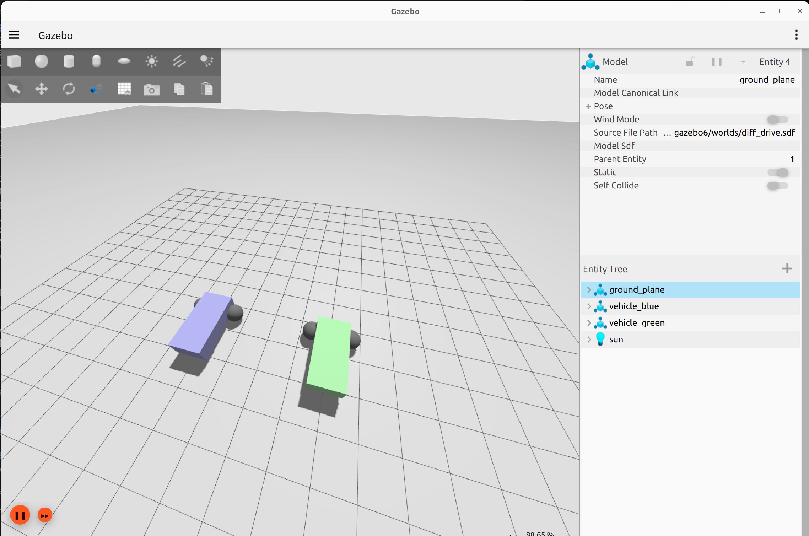
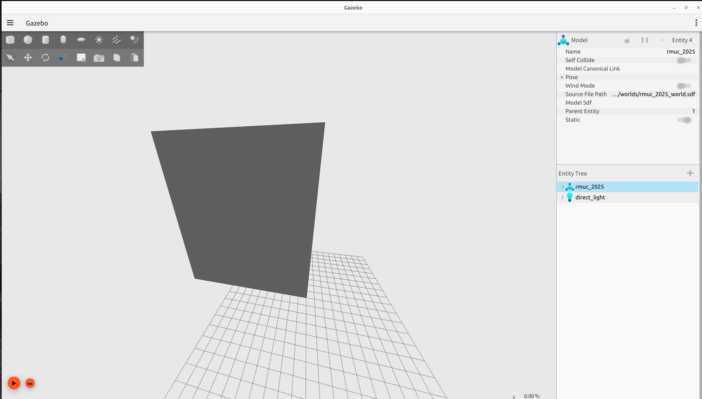
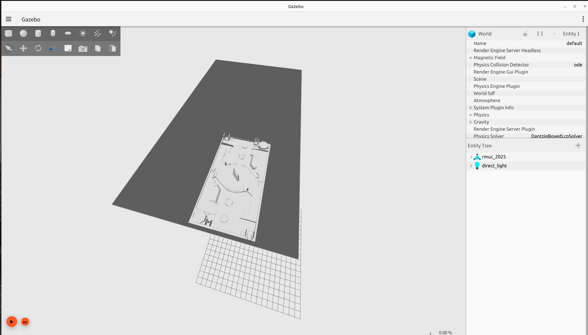
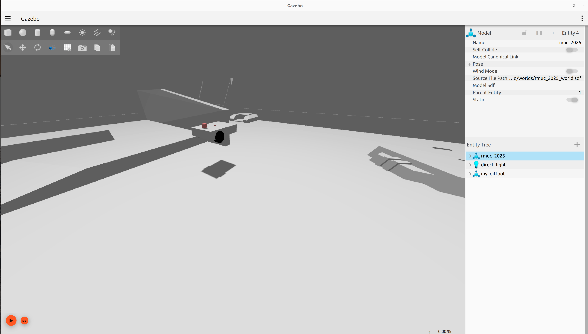
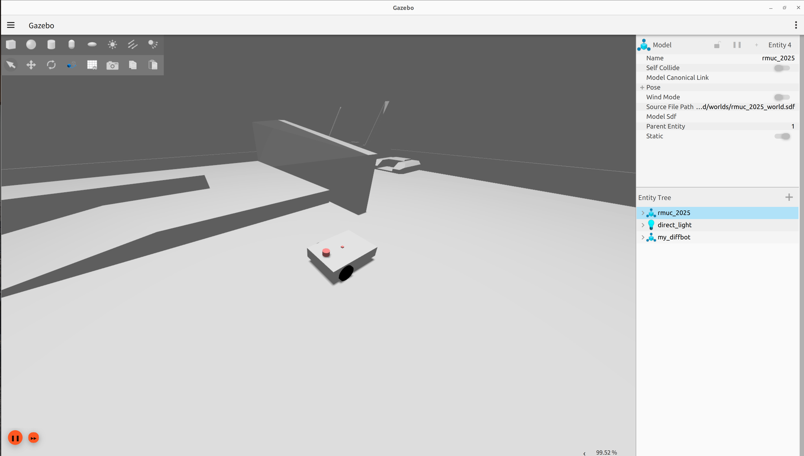
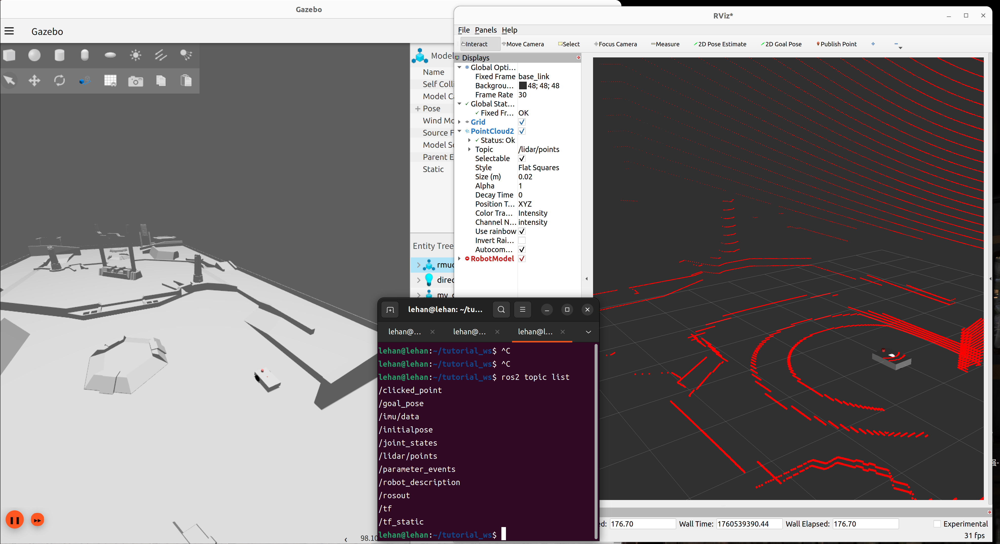

# 第四课——模拟器入门：用 Gazebo + RViz 让车“动”起来
---
在前面的教程中，我们已经基本熟悉了ROS 2的基本概念。这一课的的目标是搭建一个可以让小车真正动起来的仿真。  

## 环境准备与兼容性
大家在网上能找到的教程通常是配合旧版Gazebo的(如gazebo 11甚至9)，但是Gazebo Classic（例如 Gazebo 11）已于 2025 年被标记为 EOL，社区和官方都建议迁移到新版。考虑到大部分同学都是第一次接触，不如直接一步到位尝试部署新版。当然，在使用过程中可能会遇到一些不太容易找到解决方案的问题，这时需要大家多Google、询问LLM、检索官方文档或访问英文论坛（如Stackoverflow）。  
> 对不同 ROS 发行版会有推荐的 Gazebo 字母版本（例如 Humble 常见配合 Fortress）；社区里常见的问题包括命令名不同（有的版本需要用 `ign`，有的用 `gz`）与 `ros_gz` 包的安装差异。一般建议按官方文档安装 `ros_gz`。  

## 熟悉GAZEBO
### GAZEBO简介 
简单来说，Gazebo是一个3D的机器人动态模拟环境。它不仅仅能展示机器人的外观，也能模拟机器人在物理世界中的行为。它集成了两类引擎：  
物理引擎： 模拟真实世界的物理定律，如重力、摩擦力、碰撞等。
渲染引擎： 负责生成的3D可视化画面，提供光照、阴影、纹理。  
使用GAZEBO内置的模型（如墙壁、桌椅、日常物品）或导入自定义的3D模型，可以快速搭建一个模拟环境。Gazebo可以模拟各种常见的机器人传感器，如激光雷达、摄像头、imu、深度相机。  
Gazebo提供了ROS相关的接口，使用者可以方便地接接收传感器信息，经过处理计算后再向虚拟的机器人关节发送指令，令其移动，形成一个完整的“感知-规划-控制”闭环。
### 安装新版GAZEBO  
安装 ros_gz
```
sudo apt update
sudo apt install ros-humble-ros-gz
```  
验证：打开新终端，运行 
```
ros2 launch ros_gz_sim_demos diff_drive.launch.py
```
看是否能启动仿真界面，实际效果应该类似下图：
  

注意，如果在打开世界后发现仿真异常卡顿，可能说明gazebo没能正确调用GPU进行加速，我们稍后再尝试解决这个问题。
### 快速上手
>**首先在这里感谢来自深圳北理莫斯科大学北极熊战队的导航与仿真开源项目!本教程中的RMUC2025场地即来自他们的开源。  
另外，PolarBear24-25赛季的开源在备赛过程中也给了我很多帮助和启发。**  
**项目地址**：[https://github.com/SMBU-PolarBear-Robotics-Team/rmu_gazebo_simulator/tree/main]  

进入本教程的`/gazeboworld/worlds`文件夹，在这里启动终端，输入
```
ign gazebo rmuc_2025_world_test.sdf
```
如果一切顺利，应该出现如下世界：
  
这个看起来像墙的方块里面就是1:1的RMUC 2025场地模型  
  
~~欢迎来到Robomaster的世界。~~
接下来，我们写一个launch文件来启动这个世界，新建`my_sim`包，创建一个名为`run.launch.py`的launch文件，写入：
```
from launch import LaunchDescription
from launch.actions import SetEnvironmentVariable, ExecuteProcess
import os

def generate_launch_description():
    ld = LaunchDescription()

    # 请修改以下路径，使其指向你的gazeboworld文件夹的路径
    gazeboworld_path = "/home/lehan/tutorial_ws/src/04simulator/gazeboworld"

    models_path = os.path.join(gazeboworld_path, "models")
    worlds_path = os.path.join(gazeboworld_path, "worlds")
    world_file = os.path.join(worlds_path, "rmuc_2025_world.sdf")
    
    environment = SetEnvironmentVariable(name='GZ_SIM_RESOURCE_PATH', value=models_path)
    gazebo = ExecuteProcess(
        cmd=['ign', 'gazebo', world_file, '--verbose'],
        output='screen'
    )
    ld.add_action(environment)
    ld.add_action(gazebo)
    return ld
```  
注意到这里的`SetEnvironmentVariable`函数，Gazebo 会根据 GZ_SIM_RESOURCE_PATH 去查找模型文件（models）和世界文件（worlds），如果不设置，Gazebo 会找不到我们自己的RMUC场地的模型。
一切正常的话，运行`ros2 launch my_sim run.launch.py`，可以实现和上图一样的效果。
## 从URDF到仿真
URDF 本身只是对机器人的几何描述，在Gazebo中想要让机器人感知到周围环境，就必须加上：  
gazebo 扩展标签（URDF扩展语法）；  
对应的 <sensor> 元素；  
每个传感器的 topic 名称（方便 ROS 2 订阅）。  
### 完善URDF
在上一课，我们已经制作了一个简单的机器人URDF，我们现在需要在其基础上进行一些修改：
#### 0. 为link增加一些属性
Gazebo在解析URDF时，会检查动力学属性，如果 link 没有惯性项 `<inertial>`，会出现一些问题。
我们为两只驱动轮增加以下惯性项:
```
<inertial>
    <mass value="0.2"/> <!-- 轮子的质量，单位kg -->
    <origin xyz="0 0 0" rpy="0 0 0"/>
    <inertia
    ixx="0.0005"
    ixy="0"
    ixz="0"
    iyy="0.0005"
    iyz="0"
    izz="0.0001"/>
    </inertial>
```
#### 1. 增加激光雷达  
修改 lidar_link，使其具有 Gazebo 传感器插件
```
<!-- 激光雷达 -->
  <link name="lidar_link">
    <visual>
      <geometry>
        <cylinder length="0.04" radius="0.03"/>
      </geometry>
      <material name="red"/>
    </visual>
  </link>

  <joint name="lidar_joint" type="fixed">
    <parent link="base_link"/>
    <child link="lidar_link"/>
    <origin xyz="0.18 0.0 0.08" rpy="0 0 0"/>
  </joint>

  <!-- Gazebo 中的 3D 激光传感器 -->
  <gazebo reference="lidar_link">
    <sensor name="lidar_sensor" type="gpu_lidar">
      <ignition_frame_id>lidar_link</ignition_frame_id>
      <always_on>true</always_on>
      <update_rate>20</update_rate>
      <visualize>true</visualize>
      <topic>/lidar</topic>
      <namespace></namespace>
      <ray>
        <scan>
          <horizontal>
            <samples>1500</samples>
            <resolution>1.0</resolution>
            <min_angle>0</min_angle>
            <max_angle>6.2831852</max_angle>
          </horizontal>
          <vertical>
            <samples>128</samples>
            <min_angle>-0.12217304764</min_angle>
            <max_angle>0.90757121104</max_angle>
          </vertical>
        </scan>
        <range>
          <min>0.1</min>
          <max>50.0</max>
        </range>
      </ray>
      <noise>
        <type>gaussian</type>
        <mean>0.0</mean>
        <stddev>0.005</stddev>
      </noise>
    </sensor>
  </gazebo>
```
其中，`<ignition_frame_id>`项表示传感器消息的frame_id，如果设置错误，会导致传感器消息无法在rviz中正常显示出来。   
`<ray>`中的`<horizontal>`和`<vertical>`中包含的参数是激光雷达的视场范围和采样线数。`线数`这个概念通常是针对传统机械激光雷达的，和我们实际使用的livox mid360激光雷达略有不同，不过大家现在先不用关心他们之间的区别，感兴趣的同学可以看看附带的`livox雷达原理.pdf`。  
`<noise>`项则是测量噪声，可以按需设置。上述设置为一个经典的高斯分布（正态分布），均值为0，标准差为0.005。  
其他项都很容易按照字面内容理解，在此就不再赘述了。
#### 2. 增加imu模块
```
<link name="imu_link">
  <visual>
    <geometry><box size="0.02 0.02 0.02"/></geometry>
    <material name="red"/>
  </visual>
</link>

<joint name="imu_joint" type="fixed">
  <parent link="base_link"/>
  <child link="imu_link"/>
  <origin xyz="0 0 0.05" rpy="0 0 0"/>
</joint>

<!-- Gazebo 中的 IMU 插件 -->
  <gazebo reference="imu_link">
    <sensor name="imu_sensor" type="imu">
      <ignition_frame_id>imu_link</ignition_frame_id>
      <always_on>true</always_on>
      <update_rate>100</update_rate>
      <topic>/imu/data</topic>
      <namespace>my_diffbot</namespace>
      <imu>
        <angular_velocity>
          <x>
            <noise type="gaussian"><mean>0.0</mean><stddev>0.0002</stddev></noise>
          </x>
          <y>
            <noise type="gaussian"><mean>0.0</mean><stddev>0.0002</stddev></noise>
          </y>
          <z>
            <noise type="gaussian"><mean>0.0</mean><stddev>0.0002</stddev></noise>
          </z>
        </angular_velocity>
        <linear_acceleration>
          <x>
            <noise type="gaussian"><mean>0.0</mean><stddev>0.01</stddev></noise>
          </x>
          <y>
            <noise type="gaussian"><mean>0.0</mean><stddev>0.01</stddev></noise>
          </y>
          <z>
            <noise type="gaussian"><mean>0.0</mean><stddev>0.01</stddev></noise>
          </z>
        </linear_acceleration>
      </imu>
    </sensor>
  </gazebo>
```
大致内容同上，具体项就不再介绍了。
### 尝试生成小车  
和之前一样，为了方便管理，我们把生成小车的部分也统一写进launch文件。这个launch文件主要需要新增以下几个部分：
1. 生成机器人
```
pkg_path = get_package_share_directory('my_sim')        
robot_path = os.path.join(pkg_path, "urdf", "my_diffbot.urdf")

spawn_robot = ExecuteProcess(
    cmd=[
        'ros2', 'run', 'ros_gz_sim', 'create',
        '-name', 'my_diffbot',
        '-file', robot_path,
        '-x', '5', '-y', '5', '-z', '0.8'
    ],
    output='screen'
)
```

2. 使用robot_state_publisher发布link间的TF变换
```
with open(robot_path, 'r') as infp:
        robot_desc = infp.read()

robot_state_publisher = Node(
    package='robot_state_publisher',
    executable='robot_state_publisher',
    name='robot_state_publisher',
    output='screen',
    parameters=[{'robot_description': robot_desc}],
)
```

3. 桥接话题
```
bridge_lidar = Node(
    package='ros_gz_bridge',
    executable='parameter_bridge',
    
    arguments=[
        '/imu/data@sensor_msgs/msg/Imu@gz.msgs.IMU',
        '/lidar/points@sensor_msgs/msg/PointCloud2@gz.msgs.PointCloudPacked'
    ],
    output='screen'
)
```
这个节点的作用比较特殊，要讲清楚的话，首先要讲讲 Gazebo对于消息的管理。  
Gazebo Ign 自己有一套消息类型系统，例如： 
`gz.msgs.IMU`（IMU 数据）  
`gz.msgs.PointCloudPacked`（点云数据）  
而ROS 2 也有自己的消息类型，Gazebo 发布的消息不能直接被 ROS 2 节点订阅，反之亦然。ros_gz_bridge 提供了桥接节点，负责在 ROS 2 和 Gazebo 之间做消息转换。  
上述节点参数中的`arguments`就是进行桥接的语句。Gazebo官方文档对格式的定义如下：
>**The syntax is /TOPIC@ROS_MSG@GZ_MSG, such that TOPIC is the Gazebo internal topic, ROS_MSG is the ROS message type for this topic, and GZ_MSG is the Gazebo message type.**  

除了在启动节点时声明桥接之外，也可以单独列一个YAML文件来统一管理，YAML文件的格式如下：
```
- ros_topic_name: "scan"
  gz_topic_name: "/scan"
  ros_type_name: "sensor_msgs/msg/LaserScan"
  gz_type_name: "gz.msgs.LaserScan"
  direction: GZ_TO_ROS  # BIDIRECTIONAL or ROS_TO_GZ
```

### 查看传感器话题  
编写好launch文件之后，编译功能包并启动launch文件，再次移动视角，我们应该可以看到：

机器人悬浮在半空中，这是因为仿真还没有被启动，按下左下角的启动按钮，可以看到：

小车落地了。此时，我们在终端中输入: 
```
ros2 topic list
```
应该可以看到出现了imu和lidar的topic，在RViz中修改fixed_frame为base_link，并添加点云话题后，也可以成功看到点云了。

现在，我们已经实现了生成小车并接收来自小车上传感器的消息，接下来，我们将尝试让小车动起来，通过键盘操控小车移动。
## 让小车动起来
### 控制与 ros2_control
  到目前为止我们已经能在 Gazebo里看到机器人模型、能接收 IMU / LIDAR 等传感器数据。下一步就是“让车动起来”——在仿真里把速度命令变成电机/轮子的实际转动。
#### 动力学逆解算
  在开始了解 ros2_control 之前，我们先来理解一个基础但重要的概念：机器人的运动学逆解算。  
  对于我们在仿真中构建的两轮差速驱动机器人，控制指令通常以 /cmd_vel 话题的形式发布，包含两个关键信息：  
  >linear.x：前进/后退的线速度（米/秒）  
  angular.z：绕垂直轴旋转的角速度（弧度/秒）  

但我们的机器人实际上是通过控制左右轮的转速来实现运动的。这就需要将机器人线速度和角速度"翻译"成左右轮的具体转速----这就是运动学逆解算。  

现在假设：  
左右轮间距（轮距）为 L  
轮子半径为 r  
左轮线速度为 v_left，右轮线速度为 v_right  

那么：  
机器人的线速度：`v = (v_right + v_left) / 2`  
机器人的角速度：`ω = (v_right - v_left) / L`  

反过来，已知 v 和 ω，求左右轮速度：  
`v_left = v - (ω × L) / 2`   
`v_right = v + (ω × L) / 2`  

当然，这只是最基础的运动学逆解算。在我们实际使用的机器人上，由于底盘构型的不同，解算部分也各有不同，但基础的控制原理不同。同时，由于电机控制的高实时性和稳定性要求，这部分在实车上由电控组的同学通过单片机进行控制，并不由我们通过ros2 control进行实现。  
事实上，我们的工作到向单片机发送合适的速度指令就结束了，**而电控的同学需要想尽一切办法让底盘按照这个速度移动。同理，我们也要想尽一切办法保证传下去的速度是合理可靠的。**
#### ROS2 Control
理解了运动学逆解算的原理后，我们来看看在 ROS 2 中如何规范地实现这个功能。在此处的仿真里，推荐使用 ROS 社区通用的 ros2_control 框架来做这件事。  
ros2_control 是 ROS 官方推荐的控制层框架：它把硬件抽象层（hardware）、控制器（controllers） 与 控制管理器（controller_manager） 分离开来。


**硬件抽象层：负责与真实的硬件（或仿真中的虚拟硬件）通信**  
硬件接口是 ROS2 Control 与物理世界（或仿真世界）的桥梁。
主要类型有：  
`Command Interface`：用于向硬件发送命令  
`State Interface`：用于从硬件读取状态  

**控制器：实现具体的控制算法，如速度控制、位置控制等**  
以下伪代码展现了一个基础的控制器实现的功能  

```[C++]
void DiffDriveController::update() {
    // 1. 从 /cmd_vel 获取控制指令
    geometry_msgs::msg::Twist cmd_vel = getCmdVel();
        
    // 2. 运动学逆解算
    double left_wheel_vel = (cmd_vel.linear.x - cmd_vel.angular.z * wheel_separation_ / 2.0) / wheel_radius_;
    double right_wheel_vel = (cmd_vel.linear.x + cmd_vel.angular.z * wheel_separation_ / 2.0) / wheel_radius_;
        
    // 3. 通过硬件接口发送命令
    hardware.setCommand(left_wheel_vel, right_wheel_vel);
    }
```

**控制管理器：管理控制器的加载、切换和运行**  
控制器管理器负责控制器的整个生命周期,主要功能有：  
  加载/卸载控制器  
  启动/停止控制器  
  在控制器之间切换  
  管理控制器更新频率  


## 常见问题与排错（节选）
- **GPU加速调用失败**：   
首先，运行
    ```
    nvidia-smi
    ```
    确认显卡驱动是否安装正常。若命令行返回一个显示显卡状态的方框，则说明显卡驱动正常，否则可能需要重新安装。  
    然后，运行：
    ```
    glxinfo | grep "OpenGL renderer"
    ```
    如果提示`找不到命令 “glxinfo”，但可以通过以下软件包安装它.....`，就先安装glxinfo。  
    返回值可能是：`OpenGL renderer string: Mesa Intel(R) Graphics (RPL-P)`  
    这说明我们现在正在使用Intel CPU自带的核显进行渲染，我们将其切换过来即可。 
    将以下两个环境变量写入`~/.bashrc`：
    ```
    __NV_PRIME_RENDER_OFFLOAD=1
    __GLX_VENDOR_LIBRARY_NAME=nvidia
    ```
    然后刷新环境变量`source ~/.bashrc`，再尝试运行gazebo。  
    此时再运行`glxinfo | grep "OpenGL renderer"`，应该可以看到输出发生变化，比如在我的电脑上显示出了4060：
    ```
    OpenGL renderer string: NVIDIA GeForce RTX 4060 Laptop GPU/PCIe/SSE2
    ```
## 作业

## 参考资料
https://gazebosim.org/docs/all/getstarted/